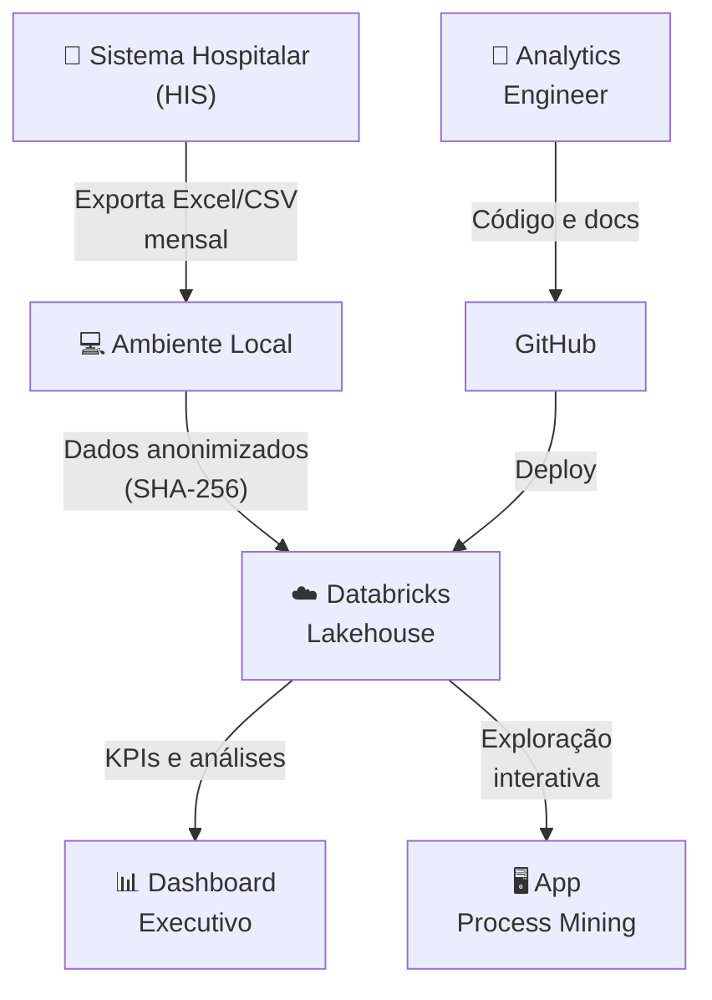
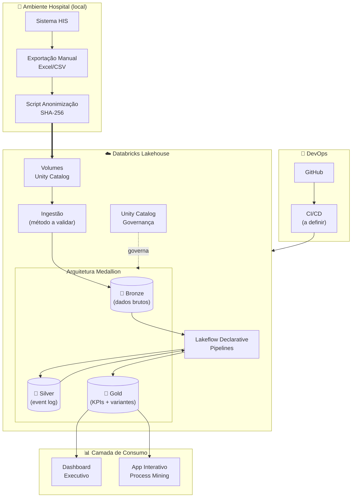
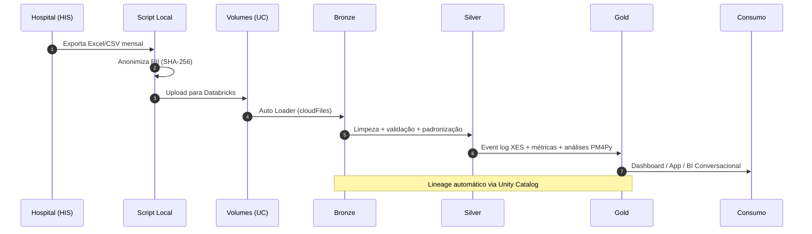

# 🏗️ Arquitetura — Mapa Digital do Fluxo do Paciente
 
> Este documento descreve a visão arquitetural do projeto e as decisões tomadas 
> até o momento. Decisões ainda não validadas estão marcadas como **planejadas**. 
> Para decisões granulares, consulte [docs/02-architecture/adr/](docs/02-architecture/adr/).
 
---
 
## 1. Contexto
 
### 1.1 Problema de Negócio
 
O Hospital Santa Rosa não possui visibilidade sistêmica sobre a **jornada real 
do paciente** — desde a chegada na recepção até a alta. Indicadores agregados 
(tempo médio total) mascaram gargalos pontuais entre etapas, dificultando 
intervenções precisas em pontos específicos do fluxo.
 
### 1.2 Stakeholders
 
| Stakeholder | Necessidade | Entregável Planejado |
|---|---|---|
| Diretoria Assistencial | KPIs estratégicos do fluxo | Dashboard executivo |
| Coordenação de Emergência | Identificar gargalos diários | App interativo |
| Gestão da Qualidade | Auditoria de conformidade | Relatórios de conformidade |
| TI / Dados | Pipeline confiável e governado | Lakehouse + Unity Catalog |
 
### 1.3 Restrições
 
- **Custo:** zero — Databricks Free Edition + ferramentas open source
- **Volume:** baixo-médio (~7k registros/mês emergência, ~900 internação)
- **Cadência:** carga mensal manual (Fase 1)
- **LGPD:** anonimização obrigatória antes do upload
- **Plataforma:** funcionalidades limitadas ao disponível na Free Edition
---
 
## 2. Visão Geral da Arquitetura
 
### 2.1 Diagrama de Contexto
 

 
### 2.2 Diagrama de Componentes (Planejado)
 

 
> ⚠️ Componentes como método de ingestão, CI/CD e camada de consumo serão 
> validados e detalhados nos sprints correspondentes.
 
---
 
## 3. Decisões Arquiteturais
 
### 3.1 Por que Lakehouse (e não Data Warehouse puro) ✅ Decidido
 
**Decisão:** Adotar arquitetura Lakehouse via Databricks + Delta Lake.
 
**Alternativas consideradas:**
 
- **DW tradicional (BigQuery, Snowflake):** excelente para SQL/BI, mas limitado 
  para ML e processamento complexo como Process Mining. Seria necessário exportar 
  dados para outro ambiente para rodar PM4Py.
- **Data Lake puro (S3 + Spark):** flexível, mas sem transações ACID, sem 
  governança nativa, complexidade operacional alta.
- **Lakehouse (escolhido):** une transações ACID e schema enforcement de DW com 
  a flexibilidade e custo de Data Lake. Permite SQL, Python e Process Mining 
  na mesma plataforma.
**Trade-offs aceitos:**
 
- ✅ SQL, Python, ML e Process Mining na mesma plataforma
- ✅ Governança unificada (Unity Catalog) sobre todos os dados
- ⚠️ Curva de aprendizado para quem vem de DW puro (BigQuery/dbt)
- ⚠️ Acoplamento moderado à plataforma Databricks
📖 **ADR:** [docs/02-architecture/adr/0001-why-lakehouse.md](docs/02-architecture/adr/0001-why-lakehouse.md)
 
### 3.2 Por que Arquitetura Medallion (Bronze/Silver/Gold) ✅ Decidido
 
**Decisão:** Separar dados em 3 camadas com responsabilidades distintas.
 
**Racional:**
 
- **Bronze:** preserva dados brutos imutáveis — permite reprocessamento e 
  auditoria completa
- **Silver:** dados validados, limpos e enriquecidos — fonte da verdade técnica
- **Gold:** dados modelados para consumo específico (KPIs, input PM4Py, BI)
Padrão amplamente adotado na indústria (Netflix, Comcast, Shell) e 
arquitetura de referência do Databricks.
 
📖 **ADR:** [docs/02-architecture/adr/0002-medallion-design.md](docs/02-architecture/adr/0002-medallion-design.md)
 
### 3.3 Por que PM4Py para Process Mining ✅ Decidido
 
**Decisão:** PM4Py como biblioteca de Process Mining.
 
**Alternativas consideradas:**
 
- **Celonis:** líder de mercado enterprise, mas pago e fechado
- **Disco (Fluxicon):** ótima experiência visual, mas não programável e 
  free tier limitado
- **Apromore:** open source, foco acadêmico, comunidade menor
- **PM4Py (escolhido):** open source, mantida pelo Fraunhofer Institute, 
  comunidade ativa, documentação robusta, integração nativa com Python
📖 **ADR:** [docs/02-architecture/adr/0004-why-pm4py.md](docs/02-architecture/adr/0004-why-pm4py.md)
 
### 3.4 Por que Anonimização Local (e não no Databricks) ✅ Decidido
 
**Decisão:** PII é anonimizada **antes** do upload ao Databricks, em script 
local executado no ambiente do hospital.
 
**Racional:**
 
- LGPD: minimiza superfície de exposição de dados sensíveis
- Defense-in-depth: dado anonimizado na origem é o padrão mais seguro
- Permite reuso do dataset anonimizado em outros contextos sem reanonimizar
- Independe de funcionalidades específicas da plataforma
📖 **ADR:** [docs/02-architecture/adr/0005-local-anonymization.md](docs/02-architecture/adr/0005-local-anonymization.md)
 
### 3.5 Pipeline declarativo vs. notebooks puros ✅ Decidido

**Decisão:** Lakeflow Declarative Pipelines como motor de transformação 
Bronze → Silver → Gold.

**Validação realizada:** Lakeflow funciona na Free Edition com compute 
serverless. Pipeline `silver_transformations` criado e executado com sucesso, 
materializando tabelas no Unity Catalog com expectations de qualidade.

**Vantagens confirmadas:**

- Materialização declarativa de tabelas via `@dlt.table`
- Validação de qualidade integrada via `@dlt.expect_or_drop`
- Tabelas gravadas diretamente no schema configurado do Unity Catalog
- Compute serverless sem necessidade de cluster dedicado

**Alternativa descartada:** notebooks PySpark imperativos — funcionais, mas 
sem validação de qualidade integrada nem gerenciamento declarativo.

📖 **ADR:** [docs/02-architecture/adr/0003-declarative-pipelines.md](docs/02-architecture/adr/0003-declarative-pipelines.md)

### 3.6 Método de ingestão ✅ Decidido

**Decisão:** Auto Loader (`cloudFiles`) com `trigger(availableNow=True)`.

**Validação realizada:** Auto Loader funciona na Free Edition com Volumes do 
Unity Catalog. O modo `availableNow` processa todos os arquivos disponíveis e 
encerra — adequado para carga mensal e compatível com a quota serverless.

**Estrutura:** cada base tem uma subpasta dedicada no Volume `landing_zone`, 
e o Auto Loader monitora cada subpasta independentemente com checkpoint próprio.

**Alternativa descartada:** `spark.read` batch — funcional, mas sem 
checkpointing automático nem schema evolution.
 
### 3.7 CI/CD 🔲 A validar
 
**Intenção:** Databricks Asset Bundles + GitHub Actions.
 
**Pendência:** validar se o Databricks CLI e Asset Bundles funcionam com a 
Free Edition. Alternativa: deploy manual ou scripts via REST API.
 
---
 
## 4. Modelo de Dados (Planejado)
 
### 4.1 Camada Bronze

| Tabela | Granularidade | Registros (mar/2026) | Origem | Refresh |
|---|---|---|---|---|
| `bronze_altas_raw` | 1 linha por alta | 908 | Excel mensal | Mensal |
| `bronze_atendimento_emergencia_raw` | 1 linha por atendimento | 8.730 | Excel mensal | Mensal |
| `bronze_cirurgias_raw` | 1 linha por cirurgia | 1.567 | Excel mensal | Mensal |
| `bronze_epidemio_raw` | 1 linha por caso epidemiológico | 821 | Excel mensal | Mensal |
| `bronze_exames_imagem_raw` | 1 linha por exame | 5.866 | Excel mensal | Mensal |
| `bronze_internacoes_raw` | 1 linha por internação | 867 | Excel mensal | Mensal |
| `bronze_exames_laboratoriais_raw` | 1 linha por exame laboratorial | 20.479 | CSV pré-processado | Mensal |
| `bronze_movimentacoes_raw` | 1 linha por movimentação | 3.613 | CSV pré-processado | Mensal |

**Características implementadas:**

- Schema flexível (schema evolution via Auto Loader `schemaLocation`)
- Append-only — dados brutos nunca são alterados
- Metadata de ingestão (`_ingestion_timestamp`, `_source_file`)
- Column Mapping habilitado para tabelas com caracteres especiais nos nomes de colunas
- Ingestão via Auto Loader com checkpoint por tabela
 
**Características planejadas:**
 
- Schema flexível (schema evolution habilitado)
- Append-only — dados brutos nunca são alterados
- Metadata de ingestão (`_ingestion_timestamp`, `_source_file`)

### 4.2 Camada Silver

| Tabela | Granularidade | Registros | Propósito | Status |
|---|---|---|---|---|
| `silver_altas` | 1 linha por alta (deduplicada) | 895 | Altas tipadas e limpas | ✅ Implementada |
| `silver_event_log` | 1 linha por evento | - | Event log padronizado | 🔲 Planejada |
| `silver_dim_paciente` | 1 linha por paciente (anonimizado) | - | Dimensão paciente | 🔲 Planejada |
| `silver_dim_atividade` | 1 linha por atividade | - | Vocabulário controlado | 🔲 Planejada |
 
**Características planejadas:**
 
- Validações de qualidade (expectations ou testes manuais)
- Padronização de timestamps
- Vocabulário controlado de atividades (recepção, triagem, consulta, etc.)
### 4.3 Camada Gold

| Tabela | Granularidade | Propósito | Status |
|---|---|---|---|
| `gold_events_*` (7 tabelas) | 1 linha por evento por fonte | Eventos normalizados no schema canônico | ✅ Sprint 2 |
| `gold_event_log` | 1 linha por evento (UNION ALL) | Event log unificado — input PM4Py | ✅ Sprint 2 |
| `gold_case_attributes` | 1 linha por atendimento | Atributos clínicos e demográficos para enriquecimento | ✅ Sprint 2 |
| `gold_data_quality` | 1 linha por fonte+atividade | Cobertura de timestamps por atividade e por caso | ✅ Sprint 2 |
| `gold_variant_analysis` | 1 linha por variante | Ranking de variantes de processo por frequência | ✅ Sprint 3 |
| `gold_bottleneck` | 1 linha por transição × período | Tempos de transição entre atividades por setor | ✅ Sprint 3 |
| `gold_conformance` | 1 linha por fonte × período | Fitness e precisão por setor | ✅ Sprint 3 |
| `gold_sna_handover` | 1 linha por handover × período | Fluxos de encaminhamento entre setores | ✅ Sprint 3 |
| `gold_sna_subcontracting` | 1 linha por padrão A→B→A × período | Delegações temporárias entre setores | ✅ Sprint 3 |
| `gold_performance_spectrum` | 1 linha por transição × mês × dia | Variação temporal do desempenho do processo | ✅ Sprint 3 |
| `gold_patient_journey` | 1 linha por episódio completo | Jornada cross-source do paciente — 6 tipos de jornada | ✅ Sprint 4 |

📖 **Dicionário completo:** [docs/03-data/data-dictionary.md](docs/03-data/data-dictionary.md)
  
---
 
## 5. Fluxo de Dados End-to-End
 

 
---
 
## 6. Governança e Segurança
 
### 6.1 Unity Catalog — Namespace Planejado
 
```
hospital_santa_rosa          (catalog)
├── bronze_fluxo             (schema)
├── silver_fluxo             (schema)
├── gold_fluxo               (schema)
└── ml_fluxo                 (schema — futuro)
```
 
**Recursos a aplicar conforme disponibilidade na Free Edition:**
 
- **Tags:** classificação de sensibilidade e domínio
- **Lineage:** rastreamento automático fonte → consumo
- **Column masking / Row filters:** a avaliar disponibilidade
### 6.2 LGPD
 
📖 **Política completa:** [SECURITY.md](SECURITY.md) e 
[docs/03-data/lgpd-compliance.md](docs/03-data/lgpd-compliance.md)
 
---
 
## 7. Observabilidade (Planejada)
 
| Aspecto | Abordagem Planejada | Status |
|---|---|---|
| **Data Quality** | Expectations ou validações manuais | 🔲 Sprint 1 |
| **Pipeline Health** | Alertas de execução | 🔲 Sprint 1 |
| **Custo (FinOps)** | Monitoramento de uso da quota Free Edition | 🔲 Sprint 0 |
| **Lineage** | Unity Catalog (automático) | 🔲 Sprint 0 |
 
---
 
## 8. Evolução Planejada
 
| Fase | Quando | O que muda |
|---|---|---|
| **Fase 1** (atual) | Sprints 0-5 | Carga manual mensal Excel/CSV, análise batch |
| **Fase 2** | Pós-MVP | Pasta monitorada com ingestão automatizada |
| **Fase 3** | Médio prazo | Conexão direta ao sistema hospitalar (CDC) |
| **Fase 4** | Longo prazo | Monitoramento preditivo de processos + alertas |
 
---
 
## 9. Referências
 
- van der Aalst, W. (2016). *Process Mining: Data Science in Action* (2nd ed.). Springer.
- Kimball, R., & Ross, M. (2013). *The Data Warehouse Toolkit* (3rd ed.). Wiley.
- [Databricks Lakehouse Architecture](https://www.databricks.com/glossary/data-lakehouse)
- [Medallion Architecture](https://www.databricks.com/glossary/medallion-architecture)
- [Unity Catalog Documentation](https://docs.databricks.com/en/data-governance/unity-catalog/)
- [C4 Model](https://c4model.com/)
---
 
**Última atualização:** Julho 2026 • **Sprint atual:** 4 — Entregáveis (Fase 1 concluída) •
**Mantenedor:** [Ediney Magalhães](https://github.com/ediney-magalhaes)
