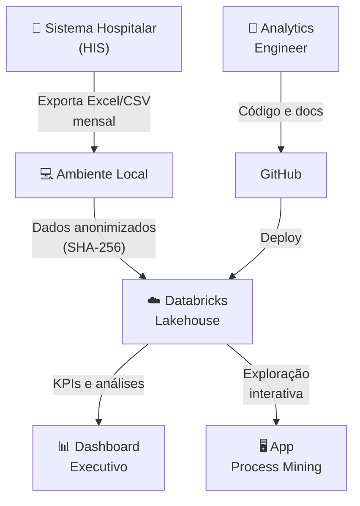
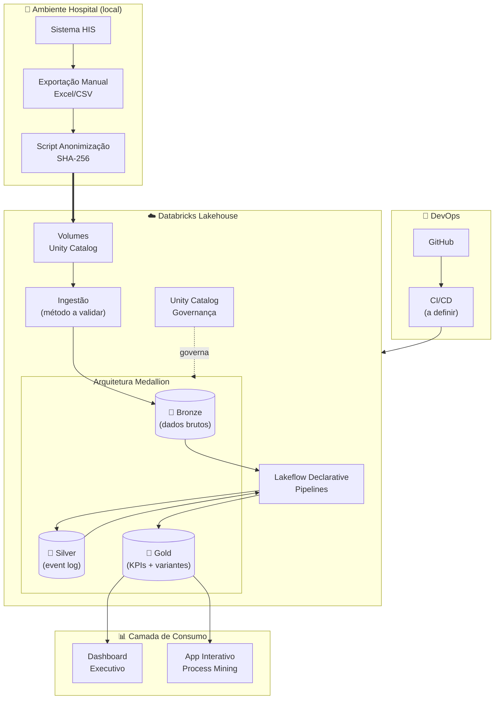
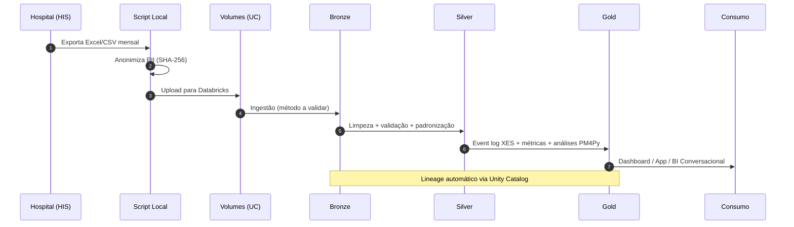

# 🏗️ Arquitetura — Mapa Digital do Fluxo do Paciente
 
> Este documento descreve a visão arquitetural do projeto e as decisões tomadas 
> até o momento. Decisões ainda não validadas estão marcadas como **planejadas**. 
> Para decisões granulares, consulte [docs/02-architecture/adr/](docs/02-architecture/adr/).
 
---
 
## 1. Contexto
 
### 1.1 Problema de Negócio
 
O Hospital Santa Rosa não possui visibilidade sistêmica sobre a **jornada real 
do paciente** — desde a chegada na recepção até a alta. Indicadores agregados 
(tempo médio total) mascaram gargalos pontuais entre etapas, dificultando 
intervenções precisas em pontos específicos do fluxo.
 
### 1.2 Stakeholders
 
| Stakeholder | Necessidade | Entregável Planejado |
|---|---|---|
| Diretoria Assistencial | KPIs estratégicos do fluxo | Dashboard executivo |
| Coordenação de Emergência | Identificar gargalos diários | App interativo |
| Gestão da Qualidade | Auditoria de conformidade | Relatórios de conformidade |
| TI / Dados | Pipeline confiável e governado | Lakehouse + Unity Catalog |
 
### 1.3 Restrições
 
- **Custo:** zero — Databricks Free Edition + ferramentas open source
- **Volume:** baixo-médio (~7k registros/mês emergência, ~900 internação)
- **Cadência:** carga mensal manual (Fase 1)
- **LGPD:** anonimização obrigatória antes do upload
- **Plataforma:** funcionalidades limitadas ao disponível na Free Edition
---
 
## 2. Visão Geral da Arquitetura
 
### 2.1 Diagrama de Contexto
 

 
### 2.2 Diagrama de Componentes (Planejado)
 

 
> ⚠️ Componentes como método de ingestão, CI/CD e camada de consumo serão 
> validados e detalhados nos sprints correspondentes.
 
---
 
## 3. Decisões Arquiteturais
 
### 3.1 Por que Lakehouse (e não Data Warehouse puro) ✅ Decidido
 
**Decisão:** Adotar arquitetura Lakehouse via Databricks + Delta Lake.
 
**Alternativas consideradas:**
 
- **DW tradicional (BigQuery, Snowflake):** excelente para SQL/BI, mas limitado 
  para ML e processamento complexo como Process Mining. Seria necessário exportar 
  dados para outro ambiente para rodar PM4Py.
- **Data Lake puro (S3 + Spark):** flexível, mas sem transações ACID, sem 
  governança nativa, complexidade operacional alta.
- **Lakehouse (escolhido):** une transações ACID e schema enforcement de DW com 
  a flexibilidade e custo de Data Lake. Permite SQL, Python e Process Mining 
  na mesma plataforma.
**Trade-offs aceitos:**
 
- ✅ SQL, Python, ML e Process Mining na mesma plataforma
- ✅ Governança unificada (Unity Catalog) sobre todos os dados
- ⚠️ Curva de aprendizado para quem vem de DW puro (BigQuery/dbt)
- ⚠️ Acoplamento moderado à plataforma Databricks
📖 **ADR:** [docs/02-architecture/adr/0001-why-lakehouse.md](docs/02-architecture/adr/0001-why-lakehouse.md)
 
### 3.2 Por que Arquitetura Medallion (Bronze/Silver/Gold) ✅ Decidido
 
**Decisão:** Separar dados em 3 camadas com responsabilidades distintas.
 
**Racional:**
 
- **Bronze:** preserva dados brutos imutáveis — permite reprocessamento e 
  auditoria completa
- **Silver:** dados validados, limpos e enriquecidos — fonte da verdade técnica
- **Gold:** dados modelados para consumo específico (KPIs, input PM4Py, BI)
Padrão amplamente adotado na indústria (Netflix, Comcast, Shell) e 
arquitetura de referência do Databricks.
 
📖 **ADR:** [docs/02-architecture/adr/0002-medallion-design.md](docs/02-architecture/adr/0002-medallion-design.md)
 
### 3.3 Por que PM4Py para Process Mining ✅ Decidido
 
**Decisão:** PM4Py como biblioteca de Process Mining.
 
**Alternativas consideradas:**
 
- **Celonis:** líder de mercado enterprise, mas pago e fechado
- **Disco (Fluxicon):** ótima experiência visual, mas não programável e 
  free tier limitado
- **Apromore:** open source, foco acadêmico, comunidade menor
- **PM4Py (escolhido):** open source, mantida pelo Fraunhofer Institute, 
  comunidade ativa, documentação robusta, integração nativa com Python
📖 **ADR:** [docs/02-architecture/adr/0004-why-pm4py.md](docs/02-architecture/adr/0004-why-pm4py.md)
 
### 3.4 Por que Anonimização Local (e não no Databricks) ✅ Decidido
 
**Decisão:** PII é anonimizada **antes** do upload ao Databricks, em script 
local executado no ambiente do hospital.
 
**Racional:**
 
- LGPD: minimiza superfície de exposição de dados sensíveis
- Defense-in-depth: dado anonimizado na origem é o padrão mais seguro
- Permite reuso do dataset anonimizado em outros contextos sem reanonimizar
- Independe de funcionalidades específicas da plataforma
📖 **ADR:** [docs/02-architecture/adr/0005-local-anonymization.md](docs/02-architecture/adr/0005-local-anonymization.md)
 
### 3.5 Pipeline declarativo vs. notebooks puros 🔲 A validar
 
**Intenção:** usar Lakeflow Declarative Pipelines (anteriormente Delta Live 
Tables) como motor de transformação, em vez de notebooks PySpark manuais.
 
**Vantagens esperadas:**
 
- Lineage automático no Unity Catalog
- Validação de qualidade nativa (expectations)
- Gerenciamento declarativo de dependências entre tabelas
- Menos código operacional
**Pendência:** validar disponibilidade e limitações na Free Edition antes de 
confirmar esta decisão. Se indisponível, a alternativa é notebooks PySpark com 
validações manuais.
 
📖 **ADR (rascunho):** [docs/02-architecture/adr/0003-declarative-pipelines.md](docs/02-architecture/adr/0003-declarative-pipelines.md)
 
### 3.6 Método de ingestão 🔲 A validar
 
**Intenção:** usar Auto Loader (cloudFiles) para detecção incremental de 
novos arquivos.
 
**Pendência:** validar se Auto Loader funciona com Unity Catalog Volumes na 
Free Edition. Alternativa: leitura batch simples via `spark.read`.
 
### 3.7 CI/CD 🔲 A validar
 
**Intenção:** Databricks Asset Bundles + GitHub Actions.
 
**Pendência:** validar se o Databricks CLI e Asset Bundles funcionam com a 
Free Edition. Alternativa: deploy manual ou scripts via REST API.
 
---
 
## 4. Modelo de Dados (Planejado)
 
### 4.1 Camada Bronze
 
| Tabela | Granularidade | Origem | Refresh |
|---|---|---|---|
| `bronze_emergencia_raw` | 1 linha por registro bruto | Excel mensal | Mensal |
| `bronze_internacao_raw` | 1 linha por internação bruta | Excel mensal | Mensal |
 
**Características planejadas:**
 
- Schema flexível (schema evolution habilitado)
- Append-only — dados brutos nunca são alterados
- Metadata de ingestão (`_ingestion_timestamp`, `_source_file`)
### 4.2 Camada Silver
 
| Tabela | Granularidade | Propósito |
|---|---|---|
| `silver_event_log` | 1 linha por evento | Event log padronizado |
| `silver_dim_paciente` | 1 linha por paciente (anonimizado) | Dimensão paciente |
| `silver_dim_atividade` | 1 linha por atividade | Vocabulário controlado |
 
**Características planejadas:**
 
- Validações de qualidade (expectations ou testes manuais)
- Padronização de timestamps
- Vocabulário controlado de atividades (recepção, triagem, consulta, etc.)
### 4.3 Camada Gold
 
| Tabela | Granularidade | Propósito |
|---|---|---|
| `gold_event_log_xes` | 1 linha por evento | Input direto para PM4Py |
| `gold_variants_summary` | 1 linha por variante de processo | Análise Pareto de fluxos |
| `gold_bottlenecks` | 1 linha por transição entre atividades | Ranking de gargalos |
| `gold_kpis_jornada` | Agregada por período/especialidade | KPIs executivos |
| `gold_conformance_results` | 1 linha por caso (jornada) | Score de conformidade |
 
📖 **Dicionário completo:** [docs/03-data/data-dictionary.md](docs/03-data/data-dictionary.md)
 
---
 
## 5. Fluxo de Dados End-to-End
 

 
---
 
## 6. Governança e Segurança
 
### 6.1 Unity Catalog — Namespace Planejado
 
```
hospital_santa_rosa          (catalog)
├── bronze_fluxo             (schema)
├── silver_fluxo             (schema)
├── gold_fluxo               (schema)
└── ml_fluxo                 (schema — futuro)
```
 
**Recursos a aplicar conforme disponibilidade na Free Edition:**
 
- **Tags:** classificação de sensibilidade e domínio
- **Lineage:** rastreamento automático fonte → consumo
- **Column masking / Row filters:** a avaliar disponibilidade
### 6.2 LGPD
 
📖 **Política completa:** [SECURITY.md](SECURITY.md) e 
[docs/03-data/lgpd-compliance.md](docs/03-data/lgpd-compliance.md)
 
---
 
## 7. Observabilidade (Planejada)
 
| Aspecto | Abordagem Planejada | Status |
|---|---|---|
| **Data Quality** | Expectations ou validações manuais | 🔲 Sprint 1 |
| **Pipeline Health** | Alertas de execução | 🔲 Sprint 1 |
| **Custo (FinOps)** | Monitoramento de uso da quota Free Edition | 🔲 Sprint 0 |
| **Lineage** | Unity Catalog (automático) | 🔲 Sprint 0 |
 
---
 
## 8. Evolução Planejada
 
| Fase | Quando | O que muda |
|---|---|---|
| **Fase 1** (atual) | Sprints 0-5 | Carga manual mensal Excel/CSV, análise batch |
| **Fase 2** | Pós-MVP | Pasta monitorada com ingestão automatizada |
| **Fase 3** | Médio prazo | Conexão direta ao sistema hospitalar (CDC) |
| **Fase 4** | Longo prazo | Monitoramento preditivo de processos + alertas |
 
---
 
## 9. Referências
 
- van der Aalst, W. (2016). *Process Mining: Data Science in Action* (2nd ed.). Springer.
- Kimball, R., & Ross, M. (2013). *The Data Warehouse Toolkit* (3rd ed.). Wiley.
- [Databricks Lakehouse Architecture](https://www.databricks.com/glossary/data-lakehouse)
- [Medallion Architecture](https://www.databricks.com/glossary/medallion-architecture)
- [Unity Catalog Documentation](https://docs.databricks.com/en/data-governance/unity-catalog/)
- [C4 Model](https://c4model.com/)
---
 
**Última atualização:** Abril 2026 • **Sprint atual:** 0 — Fundação •
**Mantenedor:** [Ediney Magalhães](https://github.com/ediney-magalhaes)
