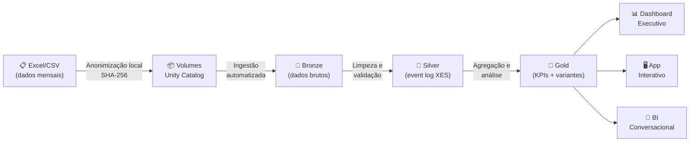

# Mapa Digital do Fluxo do Paciente
## Process Mining aplicado à jornada hospitalar com Databricks Lakehouse

  

 
**[📖 Documentação](docs/)** •
**[🏗️ Arquitetura](ARCHITECTURE.md)** •
**[🗺️ Roadmap](#-roadmap)**

 
## O Problema
 
Em hospitais brasileiros, o caminho que o paciente percorre — da recepção à 
alta — raramente é visível para quem toma decisões. Os fluxos desenhados em 
manuais e POPs (Procedimentos Operacionais Padrão) representam o processo 
*ideal*, mas não o que acontece na prática.
 
Gargalos entre triagem e consulta, esperas longas por exames, retornos 
desnecessários à recepção — tudo isso consome horas do paciente e reduz a 
capacidade operacional do hospital. O problema não é que esses gargalos 
existam. O problema é que **ninguém sabe exatamente onde, quando e por quê**.
 
A gestão hospitalar hoje identifica gargalos por percepção, reclamações ou 
auditorias manuais que levam semanas. Quando a informação chega, a realidade 
já mudou.
 
> **Pergunta central:** Onde estão os gargalos reais da jornada do paciente, 
> e qual o impacto operacional de eliminá-los?
 
## A Solução
 
Este projeto aplica **Process Mining** — uma disciplina que usa dados de 
eventos reais para descobrir, monitorar e melhorar processos — à jornada do 
paciente hospitalar.
 
Em vez de mapear fluxos manualmente, algoritmos analisam os registros 
eletrônicos do hospital (timestamps de recepção, triagem, consulta, exames, 
medicação, alta) e **reconstroem automaticamente** o caminho real que cada 
paciente percorreu.
 
Com isso, é possível:
 
- **Visualizar o fluxo real** — não o que deveria acontecer, mas o que de fato acontece
- **Identificar gargalos com precisão** — onde pacientes ficam mais tempo esperando, com dados e evidências
- **Detectar variantes anômalas** — pacientes que seguem caminhos inesperados (por que alguns passam por 3 triagens?)
- **Medir conformidade** — o quanto a prática real se alinha ao protocolo definido
- **Monitorar continuamente** — não uma foto estática, mas evolução mensal
A plataforma é construída sobre o **Databricks Lakehouse**, combinando 
engenharia de dados moderna (Delta Lake, pipelines automatizados, governança) 
com algoritmos de Process Mining (PM4Py).
 
## Impacto Esperado
 
| Indicador | Situação Atual | Meta | Por que importa |
|---|---|---|---|
| Tempo médio da jornada de emergência | Desconhecido com precisão | Mensurado e reduzido em 20% | Mais pacientes atendidos com a mesma estrutura |
| Gargalos identificados | Por percepção e reclamação | Detectados automaticamente | Decisões baseadas em dados, não em achismo |
| Variantes de processo mapeadas | Invisíveis | 100% descobertas | Base concreta para revisar protocolos |
| Tempo para identificar um problema | Semanas (auditoria manual) | Minutos (dashboard automatizado) | Resposta rápida da gestão |
| Conformidade com protocolos | Desconhecida | Mensurada mensalmente | Auditoria contínua e objetiva |
 
## Arquitetura (Planejada)
 

 
A arquitetura segue o padrão **Medallion** (Bronze → Silver → Gold), amplamente 
adotado na indústria para organizar dados em camadas progressivas de qualidade 
e refinamento.
 
📖 **Detalhes técnicos em [ARCHITECTURE.md](ARCHITECTURE.md)**
 
## Stack Técnica
 
| Camada | Tecnologia | Status |
|---|---|---|
| **Plataforma** | Databricks Free Edition (AWS) | ✅ Configurado |
| **Storage** | Delta Lake + Unity Catalog | 🔲 Sprint 0 |
| **Ingestão** | A definir (Auto Loader ou batch) | 🔲 Sprint 1 |
| **Transformação** | Lakeflow Declarative Pipelines | 🔲 Sprint 1 |
| **Process Mining** | PM4Py | 🔲 Sprint 3 |
| **Governança** | Unity Catalog | 🔲 Sprint 0 |
| **BI** | AI/BI Dashboards | 🔲 Sprint 4 |
| **App** | Streamlit | 🔲 Sprint 4 |
| **CI/CD** | GitHub Actions | 🔲 Sprint 5 |
| **Documentação** | MkDocs Material + GitHub Pages | 🔲 Sprint 5 |
 
> ⚠️ Stack sujeita a ajustes conforme validação de funcionalidades 
> disponíveis na Free Edition do Databricks.
 
## Roadmap
 
- [x] **Sprint 0** — Fundação: setup Databricks, Unity Catalog, repositório Git
- [ ] **Sprint 1** — Bronze + Silver: ingestão e limpeza dos dados
- [ ] **Sprint 2** — Gold: event log canônico no padrão XES
- [ ] **Sprint 3** — Process Mining: descoberta de processos, gargalos, conformidade
- [ ] **Sprint 4** — Entregáveis: dashboard executivo, app interativo
- [ ] **Sprint 5** — CI/CD, documentação completa, apresentação executiva
## Dados e Privacidade (LGPD)
 
Este projeto utiliza dados reais de um hospital brasileiro. Para garantir 
conformidade com a Lei Geral de Proteção de Dados:
 
- Identificadores diretos (nome, CPF, prontuário) são substituídos por hash 
  SHA-256 **antes** de qualquer upload para a nuvem
- Apenas campos necessários para análise de fluxo são utilizados
- A plataforma Databricks adiciona camadas extras de governança (controle de 
  acesso, auditoria, lineage)
- O projeto utiliza a Free Edition do Databricks, em conformidade com seus 
  termos de uso
📖 **Política completa em [SECURITY.md](SECURITY.md)**
 
## Contexto
 
Este projeto nasce da experiência prática de mais de 10 anos em dados 
hospitalares, onde a distância entre "como o processo deveria funcionar" e 
"como ele realmente funciona" é um dos maiores obstáculos para melhoria 
contínua. Process Mining é uma disciplina consolidada na Europa e ainda pouco 
explorada em hospitais brasileiros — este projeto demonstra sua aplicação 
prática com dados reais.
 
## Referências
 
- van der Aalst, W. (2016). *Process Mining: Data Science in Action*. Springer.
- Kimball, R. (2013). *The Data Warehouse Toolkit*. Wiley.
- [Databricks Documentation](https://docs.databricks.com/)
- [PM4Py Documentation](https://pm4py.fit.fraunhofer.de/)
## Autor
 
**Ediney Magalhães** — Analytics Engineer | Especialista em Dados & IA | Estatístico
 

 
---
 

⭐ Se este projeto te ajudou ou inspirou, considere dar uma estrela!
 

