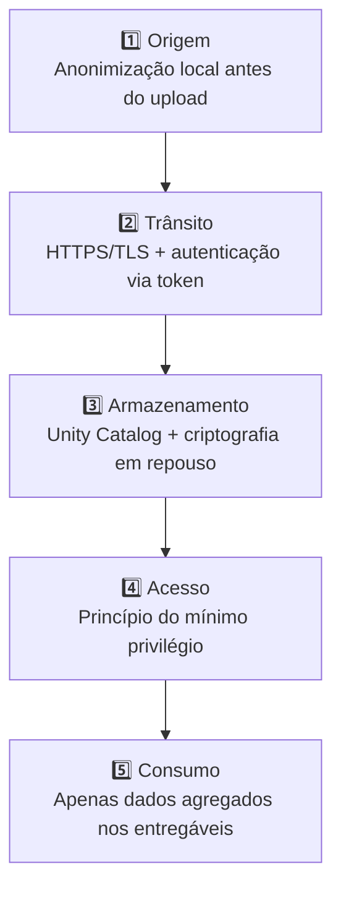
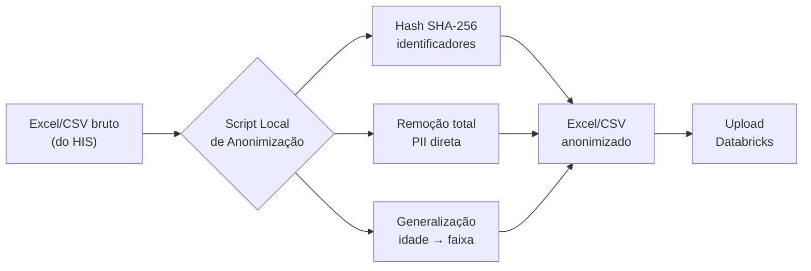

# Política de Segurança
 
Este projeto trata **dados sensíveis de saúde** e adota práticas rigorosas de 
segurança e privacidade. Este documento descreve nossa postura de segurança, 
como reportar vulnerabilidades e nossa conformidade com a LGPD.
 
---
 
## Reportar Vulnerabilidade
 
### Encontrou uma vulnerabilidade? Não abra issue pública.
 
Vulnerabilidades de segurança devem ser reportadas **privadamente** via:
 
1. **GitHub Security Advisories** (preferencial): 
   [Reportar Vulnerabilidade](../../security/advisories/new)
2. **E-mail:** edy.estatistica@gmail.com
   - Assunto: `[SECURITY] Breve descrição`
   - Inclua: descrição, passos para reproduzir, impacto estimado
### O que esperar
 
| Etapa | Prazo |
|---|---|
| Confirmação de recebimento | ≤ 48h |
| Avaliação inicial | ≤ 7 dias |
| Plano de mitigação | ≤ 14 dias |
| Patch + disclosure coordenado | Variável conforme severidade |
 
Pesquisadores que reportarem vulnerabilidades de boa-fé serão creditados 
(com permissão) no `CHANGELOG.md` e em advisory público.
 
---
 
## Princípios de Segurança
 
Adotamos **defense-in-depth** com múltiplas camadas independentes de proteção:
 

 
**Princípios fundamentais:**
 
- **Privacidade por Design** (Art. 46 LGPD) — segurança é requisito de 
  arquitetura, não feature adicional
- **Minimização de Dados** (Art. 6º, III LGPD) — coletamos e processamos 
  apenas o necessário para análise de fluxo
- **Finalidade Específica** (Art. 6º, I LGPD) — dados são usados exclusivamente 
  para análise de fluxo do paciente
- **Transparência** (Art. 6º, VI LGPD) — documentação aberta sobre o que 
  fazemos com os dados
- **Defesa em Profundidade** — múltiplas camadas independentes de proteção
---
 
## Conformidade LGPD
 
### Bases Legais Adotadas
 
Este projeto opera sob as seguintes bases legais da 
[Lei nº 13.709/2018 (LGPD)](https://www.planalto.gov.br/ccivil_03/_ato2015-2018/2018/lei/l13709.htm):
 
| Base Legal | Aplicação | Artigo |
|---|---|---|
| **Tutela da saúde** | Análise de fluxo assistencial para melhoria do cuidado | Art. 11, II, "f" |
| **Legítimo interesse** | Otimização operacional do hospital | Art. 7º, IX |
| **Anonimização** | Dados anonimizados não são considerados pessoais | Art. 12 |
 
### Categorias de Dados Tratados
 
| Categoria | Sensibilidade | Tratamento |
|---|---|---|
| **Identificadores diretos** (nome, CPF, prontuário) | 🔴 Alta | ❌ **Não trafegam** — anonimizados na origem |
| **Dados de saúde** (diagnóstico, especialidade) | 🔴 Sensível (Art. 5º, II) | Pseudonimizados + classificados no Unity Catalog |
| **Timestamps de eventos** | 🟡 Média | Mantidos (essenciais para análise de fluxo) |
| **Atributos de caso** (idade, convênio) | 🟢 Baixa | Generalizados quando necessário (ex: faixa etária) |
 
### Direitos dos Titulares
 
Embora trabalhemos com dados anonimizados (saindo do escopo da LGPD conforme 
Art. 12), mantemos rastreabilidade e processo para atender solicitações sobre 
o tratamento de dados, conforme canal oficial do hospital.
 
---
 
## Tratamento de Dados Sensíveis
 
### O que NUNCA entra no Databricks
 
❌ Nome completo do paciente  
❌ CPF, RG, CNS  
❌ Número de prontuário (sem hash)  
❌ Endereço residencial  
❌ Telefone  
❌ E-mail  
❌ Dados de familiares ou contatos  
 
### Processo de Anonimização Local
 

 
### Pseudonimização
 
Para campos onde precisamos manter consistência (mesmo paciente em múltiplos 
eventos), usamos **hash SHA-256 com salt institucional**:
 
```python
import hashlib
 
def pseudonymize(value: str, salt: str) -> str:
    """Hash SHA-256 com salt para pseudonimização consistente."""
    return hashlib.sha256(f"{salt}{value}".encode()).hexdigest()
```
 
O salt é mantido em variável de ambiente local, **nunca commitada** no 
repositório.
 
📖 **ADR:** [docs/02-architecture/adr/0005-local-anonymization.md](docs/02-architecture/adr/0005-local-anonymization.md)
 
---
 
## Arquitetura de Segurança
 
### Camada 1 — Origem (Hospital)
 
- Anonimização **antes** do upload — dado sensível nunca sai do ambiente local
- Salt em variável de ambiente, nunca em código
- Script versionado, testado e auditável
### Camada 2 — Trânsito
 
- HTTPS/TLS (padrão Databricks)
- Autenticação via Personal Access Token (PAT) com expiração de 90 dias
- Sem credenciais em código (`.env` no `.gitignore`)
### Camada 3 — Armazenamento (Databricks)
 
- Unity Catalog Volumes com criptografia em repouso (gerenciada pelo Databricks)
- Delta Lake com transações ACID e audit log nativo
- Time travel para recuperação de estado anterior em caso de incidente
### Camada 4 — Controle de Acesso
 
- Unity Catalog com princípio do mínimo privilégio
- Permissões granulares por camada (Bronze/Silver/Gold)
> ⚠️ Recursos avançados como row filters e column masking serão aplicados 
> conforme validação de disponibilidade na Free Edition.
 
### Camada 5 — Consumo
 
- Dashboards e apps exibem apenas dados agregados — sem identificação individual
- Exports restritos conforme controle de acesso do Unity Catalog
---
 
## Boas Práticas para Contribuidores
 
### O que NUNCA commitar
 
❌ Tokens, senhas, chaves de API  
❌ Arquivos `.env`, `credentials.json`  
❌ Dumps de banco de dados  
❌ Excel/CSV com dados reais (não anonimizados)  
❌ Screenshots com dados de pacientes  
❌ Logs com PII  
❌ Salt de pseudonimização  
 
### Proteções configuradas
 
| Ferramenta | Função | Status |
|---|---|---|
| **`.gitignore`** | Bloqueia padrões sensíveis (`.env`, `*.csv`, `secrets/`) | ✅ Ativo |
| **GitHub Secret Scanning** | Detecção nativa de credenciais no código | ✅ Ativo (GitHub default) |
| **Dependabot** | Atualização automática de dependências vulneráveis | 🔲 A configurar |
| **pre-commit hooks** | Scan de credenciais antes de cada commit | 🔲 A configurar |
| **gitleaks** | Scan de credenciais no histórico Git | 🔲 A configurar |
 
### Checklist antes do commit
 
- [ ] Não há credenciais hardcoded
- [ ] Não há PII em testes ou fixtures
- [ ] Não há prints/outputs com dados sensíveis
- [ ] `.env` está no `.gitignore`
### Se vazou algo
 
1. **Pare imediatamente** — não faça push adicional
2. **Rotacione** o segredo vazado (token, senha)
3. **Reescreva o histórico** com [git-filter-repo](https://github.com/newren/git-filter-repo) 
   ou [BFG Repo-Cleaner](https://rtyley.github.io/bfg-repo-cleaner/)
4. **Force-push** após coordenação com mantenedores
5. **Documente** no `CHANGELOG.md` (sem expor o valor vazado)
---
 
## Resposta a Incidentes
 
### Severidade
 
| Nível | Descrição | Tempo de resposta |
|---|---|---|
| 🔴 **Crítico** | Vazamento de dados confirmado, comprometimento de credenciais | Imediato |
| 🟠 **Alto** | Vulnerabilidade explorável, falha de autenticação | ≤ 24h |
| 🟡 **Médio** | Bug com impacto limitado, dependência vulnerável | ≤ 7 dias |
| 🟢 **Baixo** | Hardening, melhoria preventiva | Próximo sprint |
 
> Runbooks detalhados para cada tipo de incidente serão documentados em 
> `docs/07-operations/runbooks/` ao longo do projeto.
 
---
 
## Referências
 
### Legislação
 
- [Lei nº 13.709/2018 — LGPD](https://www.planalto.gov.br/ccivil_03/_ato2015-2018/2018/lei/l13709.htm)
- [Resolução CFM nº 1.821/2007](https://sistemas.cfm.org.br/normas/visualizar/resolucoes/BR/2007/1821) — 
  Prontuário eletrônico
- [Portaria MS nº 2.073/2011](https://bvsms.saude.gov.br/bvs/saudelegis/gm/2011/prt2073_31_08_2011.html) — 
  Padrões de interoperabilidade
### Frameworks de Segurança
 
- [OWASP Top 10](https://owasp.org/www-project-top-ten/)
- [NIST Cybersecurity Framework](https://www.nist.gov/cyberframework)
- [Databricks Security Best Practices](https://docs.databricks.com/en/security/index.html)
---
 
## Compromisso
 
Este projeto se compromete a:
 
- Tratar segurança como **requisito de primeira classe**, não opcional
- Manter **transparência** sobre práticas de privacidade
- Responder **rapidamente** a vulnerabilidades reportadas
- Atualizar políticas conforme **evolução da LGPD** e melhores práticas
---
 
**Última atualização:** Abril 2026 • **Sprint atual:** 0 — Fundação  
**Responsável:** [Ediney Magalhães](https://github.com/ediney-magalhaes)
